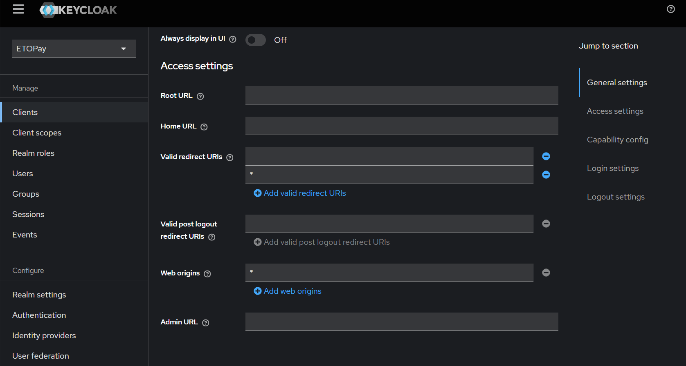
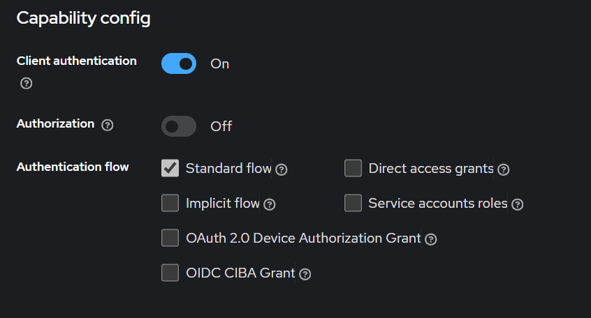

# Introduction

This is a quickstart example of how to use the ETOPay SDK to create a new wallet and generate the first receiver address. The _web-example_ is developed with `NextJs`.

## Installation

The ETOPay SDK is available on NPM, making it easy to integrate into your project. You can find it here:  

* Web - [ETOPay SDK Web](https://www.npmjs.com/package/@etospheres/etopay-sdk-wasm-web).

To install it as a dependency, simply run the following command in your project directory: 

```bash
pnpm install @etospheres/etopay-sdk-wasm-web
```

This will add the ETOPay SDK to your project, and you'll be ready to start using it (as it is already done in these examples) ! 😊

## Getting started

- Copy the .env.example file to .env and set the missing values
- Go to `https://etopayapp.etospheres.com` and get the SDK configuration for you project
- Set the SDK configuration in `src/pages/index.js`.
- Run the web example with `pnpm run dev`.

#### Running Locally #### 

To run the web example locally, follow these steps in the **Settings** tab:

 * Enable _CORS_ in Keycloak:
   * Go to **Clients** in the Keycloak Admin Console.
   * Select your client.
   * In the **Access settings** section, set **Web Origins** field to `*`.

* Set _Redirect URL_:
  * In the same **Access settings** section, set **Valid redirect URIs** field to `*`.

> 

* Enable _Standard Flow_: 
  * In the **Capability config** section, enable **Standard flow**.

> 

Save your changes to ensure proper communication between your app and Keycloak.

## Snippets

Curl snippet to get an access_token.

```bash
curl -X POST "https://auth-etopay.etospheres.com/realms/<realm>/protocol/openid-connect/token" \
     -H "Content-Type: application/x-www-form-urlencoded" \
     -d "grant_type=password" \
     -d "scope=profile email openid" \
     -d "client_id=<client_id>" \
     -d "client_secret=<client_secret>" \
     -d "username=<user_name>" \
     -d "password=<user_password>"
```
